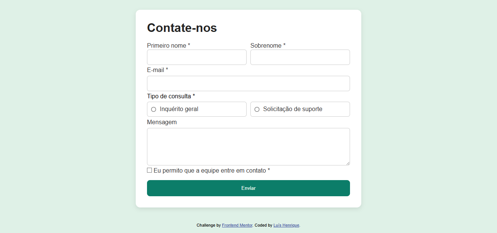
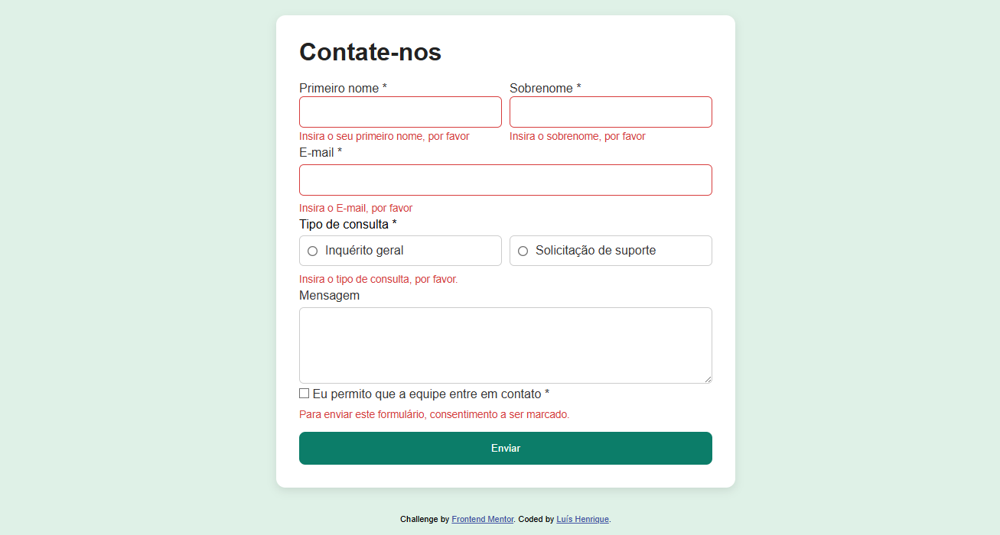
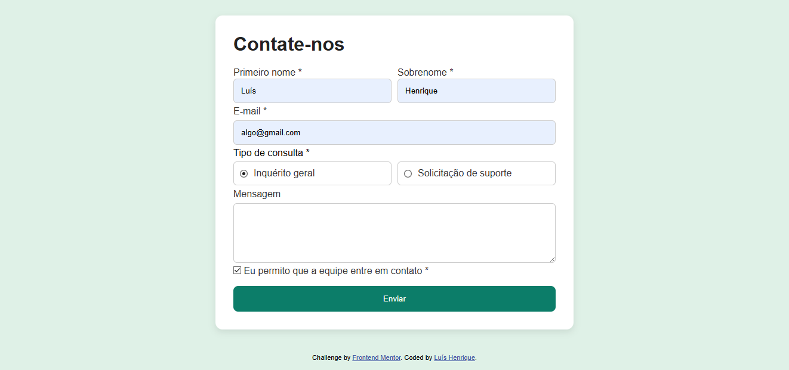
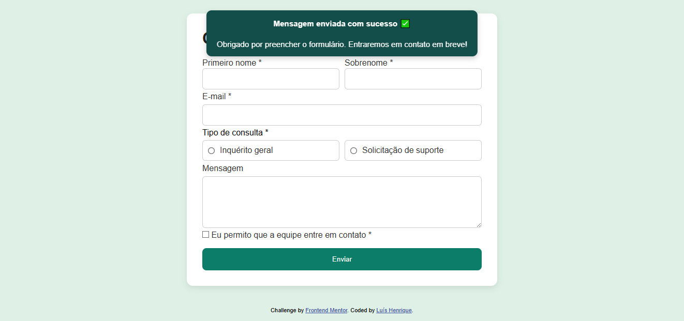

# 📌 Formulário para contato

Projeto de formulário dinâmico, desafio proposto pela plataforma Frontend Mentor

---

## 🔗 Acesso ao projeto

[🔗 Clique aqui para acessar](https://luis-hans.github.io/ContatoForm/)

---

## 🎯 Funcionalidades

- [x] Campos para os dados do usuário.
- [x] Validação de dados.
- [x] Mensagens de erro e sucesso.

---

## 🖼️ Preview






---

## 🚀 Tecnologias utilizadas

- HTML
- CSS
- JAVASCRIPT

---

## ⚙️ Como usar

```bash
# Clone o repositório
git clone https://github.com/Luis-hans/ContatoForm

# Acesse a pasta do projeto
cd ContatoForm

# Abra o arquivo index.html no navegador
```

---

## 📚 Aprendizados

- [x] Fazer um formulário dinâmico
- [x] Validações de dados
- [x] Tratamentos de elementos HTML com o JavaScript

---

## 🧾 Licença

Este projeto está sob a licença MIT. Sinta-se à vontade para usar, modificar e compartilhar!

---

## 🤝 Contato

Feito por Luís Henrique  
📬 luishenrique.lhans@gmail.com  
🐙 https://github.com/Luis-hans
